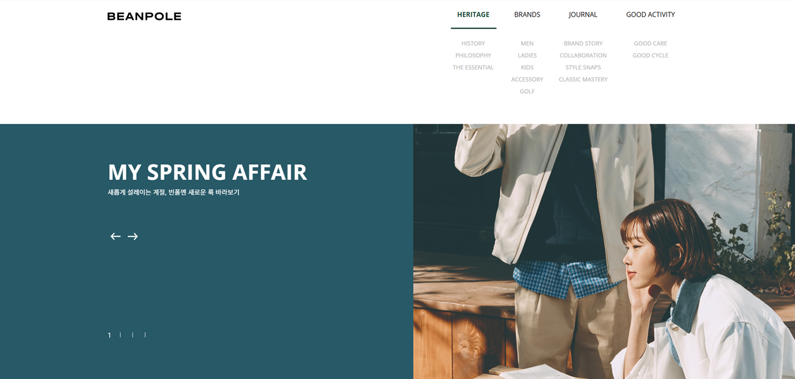
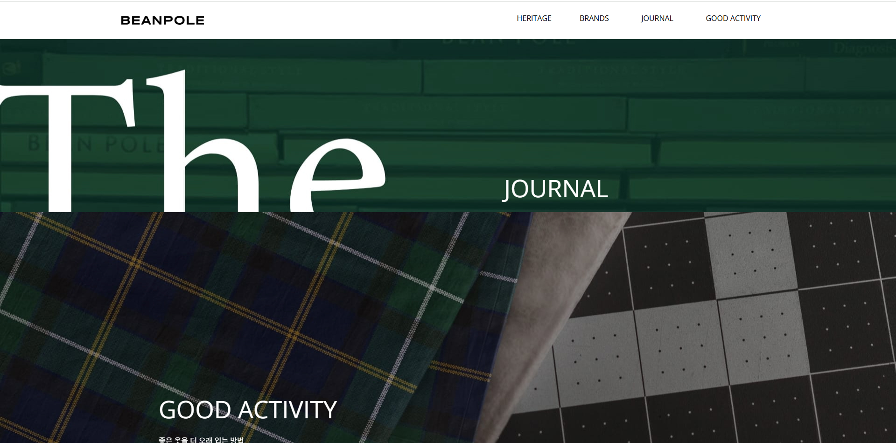
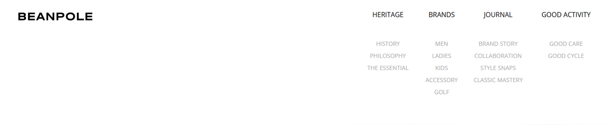

## 데스크탑 - 풀 페이지 스크롤 UI 연습 (BEABPOLE)

빈폴 웹사이트를 참조하여, 풀 스크린 스크롤 재현을 목적으로 제작한 페이지입니다. <br>
Vanilla JavaScript, GSAP, Swiper를 사용하여 <br>
풀페이지 스크롤 전환, 슬라이더 컨트롤, 디바이스 이벤트 분기 처리 등 다양한 UI/UX 기능을 구현하였습니다.

<br/>

### 🎯 주요 기능

- 반응형 내비게이션 구조 (마우스 오버 시 header 상태 변경)
- Swiper.js 기반의 메인 슬라이더 및 커스텀 pagination 처리
- GSAP을 활용한 풀페이지 전환형 스크롤 애니메이션
- 디바이스 환경 감지 후, 모바일과 데스크탑 UX 분기 처리
- 커스텀 prev/next 버튼으로 슬라이드 제어
- 터치 스와이프 감지 및 키보드/마우스 휠로 페이지 이동
- 페이지 진입 시 active 클래스 조절로 콘텐츠 상태 변경

<br/>

### 🖥️ 사용 기술

| 기술 | 설명 |
|------|------|
|  | HTML5 마크업 구조 |
|  | CSS3 스타일링 및 위치 제어 |
|  | JavaScript DOM 제어, Swiper & GSAP 연동 |
|  | Swiper.js 슬라이더 기능 구현|
|  | GSAP 애니메이션으로 부드러운 화면 전환 구현 |

<br/>

### 📸 데모 이미지

| 헤더 인터랙션 | 메인 슬라이드 | 풀 페이지 스크롤 |
|-------------|----------------|-------------|
|  |  |  |


<br/>

### ⚙️ 기능 상세 설명

### 1. 헤더 상단 인터랙션

- 마우스를 헤더에 올리면 .fixed, .active 클래스를 추가해서 상단 고정 효과와 스타일을 활성화합니다.




```javascript
const header = document.querySelector("header");

header.addEventListener("mouseenter", function () {
	header.classList.add("fixed");
	header.classList.add("active");
});

header.addEventListener("mouseleave", function () {
	header.classList.remove("fixed");
	header.classList.remove("active");
});

---

### ✅ 2. 메인 슬라이더 구현 (Swiper + 자동재생 + 페이지네이션 연동)

- 메인 배너 슬라이더를 Swiper로 구현하고, 슬라이드 변경 시 해당 페이지네이션 메뉴가 활성화됩니다.


```javascript
let prev = document.querySelector(".main_slider .prev");
let next = document.querySelector(".main_slider .next");

const mainSwiper = new Swiper(".mainSwiper", {
	loop: true,
	autoplay: {
		delay: 5000
	},
	on: {
		init: function() {
			let menuList = document.querySelectorAll(".pagination ul li a");
			let current = this.realIndex;

			menuList.forEach(function(item, index) {
				item.classList.remove("on");
				if (index === current) {
					item.classList.add("on");
				}
			});
		},
		slideChangeTransitionEnd: function() {
			let menuList = document.querySelectorAll(".pagination ul li a");
			let current = this.realIndex;

			menuList.forEach(function(item, index) {
				item.classList.remove("on");
				if (index === current) {
					item.classList.add("on");
				}
			});
		}
	}
});

if (prev) {
	prev.addEventListener("click", function(e){
		e.preventDefault();
		mainSwiper.slidePrev();
	});
}

if (next) {
	next.addEventListener("click", function(e){
		e.preventDefault();
		mainSwiper.slideNext();
	});
}
```

---

### ✅  3. 스크롤 전환 대상 페이지 구성 (main + sub)

- main_area와 .sub 요소들을 배열에 저장해서, 스크롤로 전환할 수 있는 화면 목록을 구성합니다.

```javascript
let subList = document.querySelectorAll(".container .sub");
let pageList = [];

pageList[0] = document.querySelector(".main_area");

subList.forEach(function(item){
	pageList.push(item);
});
```

---

### ✅ 4. 전체 화면 기준으로 화면 전환하는 함수 (GSAP 애니메이션)

- n 값에 따라 해당 섹션으로 부드럽게 이동하는 기능입니다.
- gsap.to()를 이용해 화면이 자연스럽게 이동됩니다.


```javascript
let n = 0;
let targety = 0;
let moving = false;
let winh;

function moveCategory(){
	winh = window.innerHeight;

	let header = document.querySelector("header");
	if (n >= 1) {
		header.classList.add("fixed");
	} else {
		header.classList.remove("fixed");
	}

	if(n <= pageList.length-1){
		pageList.forEach(function(item1, i){
			if(i <= n){
				gsap.to(item1, { top: 0, duration: 0.5, onComplete: function(){
					if(i == n){
						moving = false;

						pageList.forEach(function(item2, j){
							if(j == n){
								pageList[j].classList.add("active");
							}
							else{
								pageList[j].classList.remove("active");
							}
						});
					}
				}});
			}
			else{
				gsap.to(item1, { top: winh, duration: 0.5 });
			}
		});
	}
	else{
		let lastPage = pageList[pageList.length-1];

		gsap.to(lastPage, { top: -350, duration: 0.5, onComplete: function(){
			moving = false;
		}});
	}
}

moveCategory();
```

---

### ✅ 5. PC용 마우스휠/키보드로 화면 전환 제어

-  마우스 휠 또는 방향키를 사용해 섹션 간 이동이 가능하도록 설정하였습니다.
-  이동 중에는 중복 입력 방지 코드도 추가합니다.

```javascript
else{
	document.addEventListener("mousewheel", function(e){
		if(moving == true) return;

		if(e.deltaY < 0){
			if(n > 0){
				n -= 1;
			} else {
				return;
			}
		}
		else{
			if(n < pageList.length){
				n = n + 1;
			} else {
				return;
			}
		}

		moving = true;
		moveCategory();
	});

	document.addEventListener("keydown", function(e){
		if(e.code == "ArrowUp"){
			if(n > 0){
				n -= 1;
			} else {
				return;
			}
		}
		else if(e.code == "ArrowDown"){
			if(n < pageList.length){
				n += 1;
			} else {
				return;
			}
		}

		moving = true;
		moveCategory();
	});
}
```
